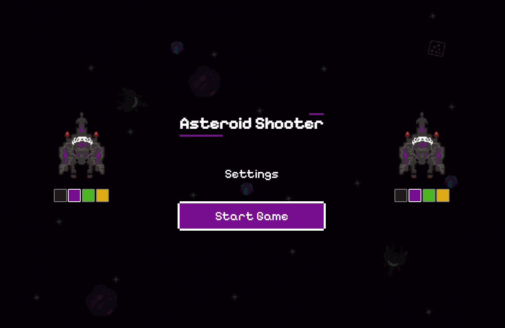
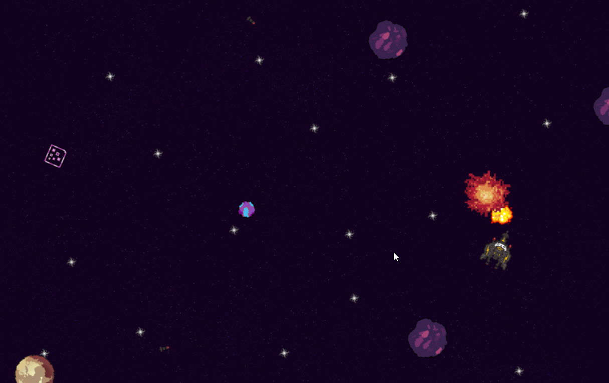
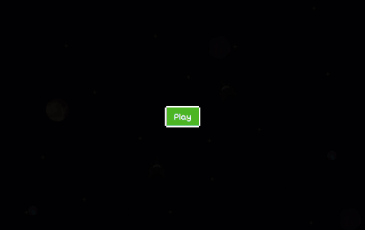

# 2D Asteroid Game
Fast-paced two-player arcade shooter built with TypeScript and HTML canvas. Two players control spaceships, dodge asteroids, collect powerupsm and battle with one another in a retro-styled space.






## Demo

## 🎮 Gameplay

- Two-Player Local Multiplayer: Battle against a friend on the same keyboard
- Asteroid Physics: Dynamic asteroid collisions with realistic physics
- Power-Ups:
  - AOE: Fires projectiles in all directions
  - Shotgun: Shoots three projectiles in a spread pattern
- Thrust Mechanic: Double-tap movement keys to boost in that direction
- Animated Thrust Flames: Sine wave-based flame animation when boosting
- Scoring System: Track wins between players
- Collision Detection: Ships bounce off asteroids and each other

Asteroids and players collide using simple physics-based reflection, making every match chaotic and unpredictable.

## ⚙️ Techical Features

- **Entity-Component System**: Modualar game objects (Ships, Projectiles, Asteroids, PowerUps,..)
- **Web Audio API**: Spatial sound effects and background music as well as menu key sounds
- **Singleton Pattern**: Centerlized sound management service
- **Responsive Canvas**: Automatically adjusts to window size
- **State Management**: Game states (READY, PLAYING, PAUSED, SCORE, MAIN)


## 🕹️ Controls

-Player One
Move: W, A, S, D
Shoot: T
Double-tap any direction: Thrust boost

Player Two
Move: Arrow keys
Shoot: M
Double-tap any direction: Thrust boost

Controls are displayed in the Settings menu with visual indicators for each key and color indication for player.

-System Controls:
Tab : Toggle scoreboard
Escape: Pause/Resume game

## ♿ Accessibility

Keyboard-only navigation supported

Focus trapping in modal dialogs

ARIA attributes for interactive elements

Visual feedback for selected options


## Installation 

1. Clone the repository (git clone https://github.com/M4sayev/asteroid-game.git)
2. Change the directory (cd asteroid-game)
3. Ensure assets are properly downloaded
4. Run vite server (npm run dev)
5. Go to http://localhost:5173
6. Bring a friend and enjoy the game

## 🗂️ Project Structure

```
docs                 # Documentation (images, demo gif)
public/assets.       # Custom game assets (background, ships, projectiles, asteroid, audios, ...)
src/
├── constants/       # Reusable constants (Player control key bindings, asteroid options, player color palette)
├── entities/        # Game objects (Ship, Asteroid, Projectile, Entity, PowerUpm SoundManager)
├── mappers/         # mapper functions to turn cumbersome text into smaller readable 
├── menu/            # Menu, MenuState, MenuControls, colorPicker
├── settings/        # Per player setting menu DOM objects and events
├── template/        # Reusable templates (border, intructionItem, playerSettingTemplate)
├── utils/           # Helpers and utilities
├── types/           # Shared TypeScript types
├── main.ts          # Game bootstrap
└── game.ts          # Core game loop
```


## 🧠 Design Notes

The game uses axis-aligned bounding box (AABB) collision detection

Entities share a common BaseEntity class

Physics behavior is intentionally arcade-style rather than realistic


<p> 
  ***Sound effects: Custom-made using friends' audio messages😅***
</p>
Thanks to Freesound community for providing free background music 

